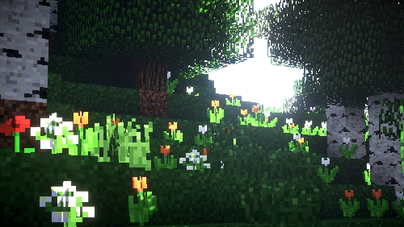

# 👋 안녕하세요! 저는 백엔드 개발자입니다.

- 안녕하세요! 저는 백엔드 개발을 하고 있는 **joowan0228** 입니다.
- 우분투로 ‘마인크래프트’ 게임 서버 운영 중 (구글 클라우드 VM + 네임서버 + SSH로 원격으로 관리 중)
- 마인크래프트 바닐라, 스피곳, 페이퍼, 프록시(Velocity), 포지, 네오포지, 패브릭 서버를 만들어봤습니다
- 파이썬으로 다양한 ‘디스코드 봇’ 개발, 유지보수 중
- 꾸준한 학습, 경험으로 지속해서 성장하는 개발자가 되고자 합니다!

---

## 🛠️ 기술 스택

---

## 📊 깃허브 스탯

---

## 📚 개발 블로그 & 노션 포트폴리오

- [개발 블로그 (준비 중)](#)
- [노션 포트폴리오 (준비 중)](#)

---

## 📫 연락처

- 이메일: pat7654@naver.com

---

## 🔥 방문자 수

